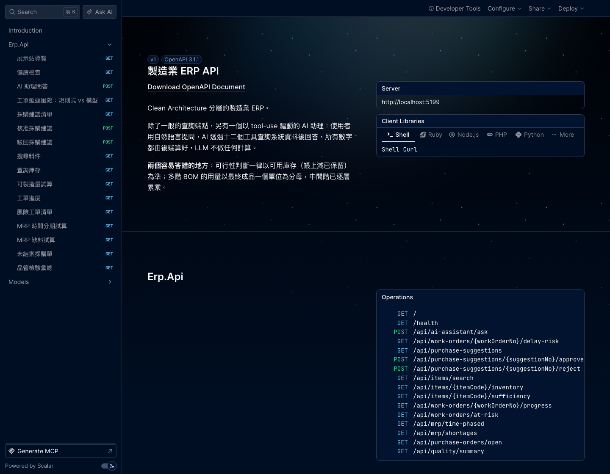

# 製造業 ERP 系統

[](https://github.com/thothawei/manufacturing-erp/actions/workflows/ci.yml)

Clean Architecture 分層的製造業 ERP，含一個以 tool-use 驅動的 AI 助理：
使用者用自然語言提問，AI 透過九個唯讀工具查詢系統資料後回答，所有數字都由後端算好。
第九個工具是本機向量檢索（RAG），在 SOP、維修手冊與客訴紀錄裡找相關段落並附上引用來源。



啟動後開 http://localhost:5199/scalar/v1 就是上面這個介面 ——
十個端點都有中文說明與參數型別，可以直接在瀏覽器裡試打。

258 個測試通過、0 警告（另有 3 個檢索品質測試要本機有 Ollama 才跑，裝了就是 261）。
**唯一未驗證的環節**：`AnthropicLlmClient` 從未對真實 LLM 發過請求（開發機沒有金鑰），
送出的 HTTP 請求內容已用本機假伺服器逐欄檢查。整條路徑則實跑通過一次 ——
`/api/ai-assistant/ask` → tool-use 迴圈 → OmniRoute → provider → 工具查到真實的
seed 資料 → 最終答案，provider 那端是本機 stub，不是真的模型。
RAG 那一側已對真實 Ollama（`bge-m3`）實跑驗證過 —— 而且那一輪實測換掉了預設模型，
見「為什麼不是 nomic-embed-text」。

| 想看什麼 | 去哪裡 |
|---|---|
| 三十秒跑起來、實際輸出、設計問答 | [`docs/demo-and-design-notes.md`](docs/demo-and-design-notes.md) |
| 架構決策與踩過的坑 | 本文件以下各節 |
| 工具契約、庫存計算基準、防幻覺機制 | [`docs/ai-assistant-module-plan-v2.md`](docs/ai-assistant-module-plan-v2.md)（程式碼有九處註解指向它） |
| 規劃與實作的逐條對帳、剩餘工作 | [`docs/ai-assistant-module-plan-v3.md`](docs/ai-assistant-module-plan-v3.md) |
| RAG 模組的範疇、資料流、七個決策點 | [`docs/rag-module-plan-v1.md`](docs/rag-module-plan-v1.md) |
| 最初的規劃長什麼樣 | [`docs/ai-assistant-module-plan-v1.md`](docs/ai-assistant-module-plan-v1.md)（動工前原貌） |

規劃演進是 **v1 原始構想 → v2 動工前修訂 → v3 實作完成後對帳**。

## 專案結構

```
src/
  Erp.Domain          實體與領域規則，不依賴任何外部套件
  Erp.Application     使用案例服務 + Repository 介面與 IAiAssistantService（port）
  Erp.Infrastructure  Persistence（EF Core）、AI（Anthropic tool-use）、
                      Rag（Ollama embedding + 向量檢索）三個平行子系統
  Erp.Api             HTTP 端點
tests/
  Erp.Application.Tests      Application 層單元測試（以 in-memory 假 Repository 驅動）
  Erp.Infrastructure.Tests   EF Core 整合測試、tool-use 迴圈測試、Anthropic wire format 測試
  Erp.Api.Tests              HTTP 端點測試（例外 → 狀態碼對映）
  Erp.ArchitectureTests      分層邊界測試（Domain 不得碰 AI 或 EF Core）
docs/
  demo-and-design-notes.md         展示腳本與設計問答
  ai-assistant-module-plan-v3.md   現行規劃：實作對帳與剩餘工作
  ai-assistant-module-plan-v2.md   設計規範：工具契約、庫存基準、防幻覺機制
  ai-assistant-module-plan-v1.md   最初的規劃（動工前，保持原貌）
  rag-module-plan-v1.md            文件語意檢索的規劃與七個決策點
```

Domain 完全不知道 AI 的存在：`IAiAssistantService` 定義在 Application，實作在 `Infrastructure/AI`，
與 `Infrastructure/Persistence` 平行，跟既有的 Repository 一樣是依賴反轉。

`Infrastructure/Rag` 是第三個平行子系統，依賴方向是 `AI → Rag → Persistence`。
Domain 與 Application 都不知道向量或 embedding 的存在，由架構測試保護。

依賴方向固定為 `Api → Infrastructure → Application → Domain`，Domain 不知道上層存在。

## 開發環境

需要 .NET 10 SDK。本機以 Homebrew 安裝時要設定：

```bash
export DOTNET_ROOT="/opt/homebrew/opt/dotnet/libexec"
```

建置與測試：

```bash
dotnet build && dotnet test
```

格式由 `.editorconfig` 規範（C# 4 空格、專案檔與 JSON/YAML 2 空格），CI 會驗證：

```bash
dotnet format --verify-no-changes
```

啟動 API（開發模式會自動建表並灌入展示資料）：

```bash
dotnet run --project src/Erp.Api --urls http://localhost:5199
```

啟動後開 **http://localhost:5199/scalar/v1** 是互動式 API 文件（Scalar）：
十個端點都有中文說明與參數型別，可以直接在瀏覽器裡試打，不必寫 curl。
只在開發環境開放 —— 正式環境不需要把端點結構公開出去。

資料庫是 SQLite 檔（`src/Erp.Api/erp.db`），刪掉再啟動就會重新產生一份乾淨的展示資料。

## 目前進度

| 階段 | 狀態 |
|---|---|
| Phase 1 — AI 工具背後的查詢／計算服務 | 完成，含 EF Core 資料層與種子資料 |
| Phase 2 — Infrastructure.AI 與 tool-use 迴圈 | 完成；**尚未對真實 API 驗證過**（見下方） |
| Phase 3 — 補完 8 個工具、架構測試與防幻覺測試 | 完成 |
| Phase 3.5 — 規劃對帳後補齊的缺口（錯誤處理、錯誤碼、稽核 log、user-secrets） | 完成 |
| Phase 4 — 展示準備 | 完成（`docs/demo-and-design-notes.md`）；真實 API 驗證待金鑰 |
| Phase 5 — 文件語意檢索（RAG，第 9 個工具） | 完成，已對真實 Ollama 實跑驗證（實測換掉了預設 embedding 模型） |

### 八個 Application 服務（AI 工具背後真正做事的地方）

| 服務 | 職責 |
|---|---|
| `ItemMasterQueryService` | 料號／品名關鍵字搜尋 |
| `InventoryQueryService` | 帳上／保留／可用庫存查詢 |
| `BomExplosionService` | 多階 BOM 展開、以可用庫存試算最大可製造量與缺料件 |
| `WorkOrderProgressService` | 工單途程進度查詢 |
| `WorkOrderRiskService` | 工單延遲風險判定（逾期 + 缺料兩種來源） |
| `MrpCalculationService` | MRP 缺料試算與建議採購量 |
| `PurchasingQueryService` | 未結案採購單查詢 |
| `QualityInspectionQueryService` | 品管檢驗結果彙總 |

## 三個必須知道的計算約定

這三條寫死在程式碼與測試裡，改動前先看 [`docs/ai-assistant-module-plan-v3.md`](docs/ai-assistant-module-plan-v3.md)：

1. **可行性計算一律以 `AvailableQty`（帳上 − 已保留）為基準**，不使用帳上庫存。用帳上庫存會把別張工單保留的料重複計入，導致「系統說夠、現場缺料」。
2. **`RequiredPerFinishedUnit` 的分母是最終成品一個單位**，多階 BOM 的中間階用量會逐層累乘。例如 `TV-100 → CHASSIS-02 ×3 → SCREW-05 ×4`，螺絲對成品的用量是 12 而不是 4。
3. **BOM 展開一律展到葉節點原料，不動用半成品既有庫存。** 這會低估可製造量但不會高估，對交期判斷是安全方向。

## AI 助理

預設不直接打 Anthropic 官方，而是走本機的 [OmniRoute](https://github.com/diegosouzapw/OmniRoute) gateway。
`AnthropicLlmClient` 的轉換程式碼一行都不用改：OmniRoute 有 Anthropic 相容的
`/v1/messages` 端點，只要把 `AiAssistant:BaseUrl` 指到它的根網址，
`/v1/messages` 這段由 SDK 自己接上去。

```bash
npm install -g omniroute && omniroute   # 另開一個終端機跑著，預設 20128 埠
```

金鑰改填 OmniRoute 儀表板 → Endpoints 的那一把（格式是 `sk-<machineId>-<keyId>-<crc>`）。
本機開發用 user-secrets（存在專案外，不可能被誤 commit）：

```bash
dotnet user-secrets set "AiAssistant:ApiKey" "sk-..." --project src/Erp.Api
```

`./scripts/set-api-key.sh` 只收 `sk-ant-` 開頭的官方金鑰，擋掉貼錯東西的情況 ——
OmniRoute 的金鑰請用上面那行直接寫入。金鑰不要寫進 `appsettings.json`。

模型代號也是 OmniRoute 的，預設釘死 `anthropic/claude-opus-5`（帶 provider 前綴的完整代號），
所以 OmniRoute 那邊要先連好一個能出 Claude 的 provider。
九個工具全靠 tool-use，釘死才知道是誰在答、答得好不好；
換成 `auto` 是交給它按當下可用的 provider 自動選（帶 `tools` 的請求會走它的
tool-bearing bypass，轉給單一模型處理，tool-use 不會被拆散），但路由到哪個模型是 runtime 才知道的事。

跟官方端點有一個行為差異是實測出來、程式碼有處理的：上游 provider 回空內容時，
OmniRoute 會補一個寫死 `(empty response)` 的 text 區塊（官方端點只會回 `tool_use`，
不補這一塊）。`AnthropicLlmClient` 會把這個佔位符丟掉，`AiAssistantService` 則在
最終回應完全沒有文字時回一句說得清楚的話，不會把英文佔位符或空字串當成答案送出去。

啟動時會印出生效的設定、端點與金鑰來源（只印來源、不印值）：

```
AI 助理設定：模型 anthropic/claude-opus-5，端點 http://localhost:20128（server-side refusal fallback 關閉），工具迴圈上限 5 輪，逾時 60 秒，API 金鑰來源：設定檔或 user-secrets
```

### 改回直接打 Anthropic 官方

`appsettings.json` 的 `AiAssistant` 拿掉 `BaseUrl`、`UseServerSideFallback` 設回 `true`、
`Model` 改回 `claude-opus-5`，金鑰換成 `sk-ant-...`（或環境變數 `ANTHROPIC_API_KEY`）即可。

`UseServerSideFallback` 管的是 Anthropic 的 server-side refusal fallback ——
安全分類器拒答時自動改由 `claude-opus-4-8` 作答。那是官方端點才有的請求參數，
所以打 gateway 時 beta 旗標與 `fallbacks` 整組不送（不是送成 `null`，是整個欄位不出現），
備援交給 OmniRoute 自己的路由做。兩層備援疊在一起只會讓「這句話是誰答的」變得無法追。

```bash
dotnet run --project src/Erp.Api --urls http://localhost:5199
```

```bash
curl -X POST http://localhost:5199/api/ai-assistant/ask -H 'Content-Type: application/json' -d '{"question":"面板還有多少可以用？"}'
```

沒設金鑰時回 503 與清楚訊息，不會洩漏 SDK 堆疊。

### 九個工具

全部都是唯讀查詢，沒有一個會寫入資料庫。前八個都只是薄薄一層，
把參數轉交給既有的 Application Service，數字一律由後端算好。

| 工具 | 對應服務 |
|---|---|
| `search_items` | `ItemMasterQueryService` |
| `get_item_inventory_status` | `InventoryQueryService` |
| `check_material_sufficiency_for_item` | `BomExplosionService` |
| `get_work_order_progress` | `WorkOrderProgressService` |
| `list_work_orders_at_risk` | `WorkOrderRiskService` |
| `run_mrp_shortage_analysis` | `MrpCalculationService` |
| `list_open_purchase_orders` | `PurchasingQueryService` |
| `get_quality_inspection_summary` | `QualityInspectionQueryService` |
| `search_documents` | `DocumentSearchService`（`Infrastructure/Rag`，不經 Application） |

`search_documents` 是唯一不轉呼叫 Application Service 的工具：語意檢索是基礎設施能力
（embedding HTTP 呼叫與向量運算），不是領域使用案例。讓它經過 Application 就得在那裡
定義一個帶相似度分數的型別，而「Domain／Application 不得知道向量這回事」是架構測試釘住的規則。
取捨見 [`docs/rag-module-plan-v1.md`](docs/rag-module-plan-v1.md) 決策 D5。

新增工具要改三個地方，少改一個測試就會紅：`ToolCatalog.All`、`ToolDispatcher`
的 switch、以及 `ToolCatalogConsistencyTests.SampleValue`（沒有範例值會直接擲錯）。

### 組成

| 類別 | 職責 |
|---|---|
| `ILlmClient` + `Llm*` 中性模型 | 供應商抽象。換一家 LLM 只要換 `AnthropicLlmClient`，迴圈與工具定義都不動 |
| `AnthropicLlmClient` | 官方 Anthropic C# SDK 的型別轉換；把 SDK 例外轉成 `LlmUnavailableException` |
| `ToolCatalog` | 工具的名稱、說明與 JSON Schema，集中一份 |
| `ToolDispatcher` | 工具名稱 → 呼叫既有 Application Service，序列化成 snake_case JSON |
| `AiAssistantService` | tool-use 迴圈，輪數上限預設 5 |
| `UnicodeNormalizingHandler` | 見下方「中文逃逸」 |
| `NormalizedDecimalConverter` | 數量輸出 `30` 而不是 `30.0`，見下方 |

### 工具錯誤契約

工具失敗時回傳 `{ "error_code": ..., "message": ... }`，`message` 給人看，
`error_code` 讓 LLM 有依據決定下一步（system prompt 逐碼說明該怎麼反應）：

| error_code | 情境 | LLM 該做的事 |
|---|---|---|
| `ENTITY_NOT_FOUND` | 資料不存在 | 告知查不到，不要重試 |
| `INVALID_ARGUMENT` | 參數缺漏或格式不對 | 依 message 修正後可重試一次 |
| `NOT_APPLICABLE` | 參數合法但問法不適用（如對原物料問可製造量） | 說明原因，不要重試 |
| `SERVICE_UNAVAILABLE` | 依賴的外部服務沒跑（RAG 需要的 Ollama） | 說明原因並建議改用結構化查詢，不要重試 |
| `UNKNOWN_TOOL` / `INTERNAL_ERROR` | 呼叫了不存在的工具／未預期錯誤 | 不要重試 |

未預期例外一律降級成單一工具的失敗，不會讓整段對話回 500；
例外全文只進伺服器 log，回給 LLM 的內容不含型別、堆疊或內部細節。

### 稽核軌跡

每次工具呼叫都留一筆結構化紀錄 —— 助理最後只吐出一段自然語言，
沒有這條 log 就無從得知那段話是根據哪些查詢組出來的：

```
工具呼叫 get_item_inventory_status 完成，成功：True，耗時 12 ms，參數：{"item_code":"PANEL-01"}
```

未預期例外另外記一筆 `Error`，含例外全文；回給 LLM 的內容則不含任何內部細節。

RAG 的檢索層另外記一筆，因為通用那行記不到它獨有的兩個數字：

```
文件檢索完成，片段總數 33，命中 2 段，最高相似度 0.7673，門檻 0.5，耗時 80 ms
```

**最高相似度是過濾之前的**，而且刻意不回給 LLM。助理說「文件裡查不到」之後，
要判斷是語料真的沒有、還是門檻調太高，只有這個數字能回答。

## 文件語意檢索（RAG）—— 可選模組

**沒裝 Ollama 也能跑。** 核心 ERP 與前八個工具完全不依賴它，只有 `search_documents`
會回 `SERVICE_UNAVAILABLE` 並說明原因。`dotnet run` 直接跑得起來，不會因為少裝東西而啟動失敗。

要啟用的話需要本機 Ollama：

```bash
brew install ollama && ollama serve
```

```bash
ollama pull bge-m3
```

然後刪掉 `src/Erp.Api/erp.db` 重新啟動，索引會在 seeding 之後自動建立。
啟動時會印出索引狀態（跟金鑰來源那行同一個理由 —— 否則只能靠猜）。兩條都是實跑貼上的：

```
文件檢索索引建立完成：7 份文件、33 段、模型 bge-m3
文件語意檢索：索引 33 段，模型 bge-m3，相似度門檻 0.5
```

沒裝 Ollama 時印的是：

```
文件語意檢索：索引 0 段，模型 bge-m3，相似度門檻 0.5（索引未建立：需要本機 Ollama 並執行 ollama pull bge-m3；其他八個工具不受影響）
```

### 技術選擇

| 項目 | 選擇 | 理由 |
|---|---|---|
| Embedding | 本機 Ollama HTTP（`/api/embeddings`），模型 `bge-m3` | 零成本、離線可跑、不需要金鑰或雲端帳號 |
| 向量儲存 | 既有 SQLite 的 `document_chunks`，float32 BLOB | 不必多跑一個服務；1024 維一段 4096 bytes，33 段共約 132 KB |
| 相似度 | C# 手寫 brute-force cosine | 33 段 × 1024 維約三萬四千次乘加。實測單次查詢 19–80 ms，其中絕大部分是 embedding 的那一次往返 |

沒有引入 Qdrant／pgvector，也沒有引入 SIMD 套件。依賴增加了 —— 零個。

實測數字（`bge-m3`，33 段語料）：建索引 1969 ms（33 次 embedding 往返），
查詢 19–80 ms，索引 132 KB。

### 為什麼不是 nomic-embed-text

第一版預設用 `nomic-embed-text`，實跑之後換掉了。這是整個模組最值得記錄的一次實測：

| 模型 | 7 題相關查詢的 top-1 命中 | 相關查詢最高分 | **無關查詢最高分** | 有可用門檻嗎 |
|---|---|---|---|---|
| `nomic-embed-text`（768 維） | 1/7 | 0.648–0.759 | **0.594、0.622** | **沒有** —— 兩個區間重疊 |
| `bge-m3`（1024 維） | 4/7（top-3 含正確來源 7/7） | 0.579–0.757 | **0.401、0.456** | 有，0.5 落在中間 |

無關查詢是「今天天氣如何？」與「請幫我寫一段 Python 程式」。
在 `nomic-embed-text` 下它們拿到 0.59–0.62，比真正相關的查詢還高 ——
**這代表不存在任何門檻值能把相關與無關分開，防幻覺的第一道防線形同不存在**，
而單元測試完全看不出來（測試用的是假 embedding，驗得了「門檻有沒有被套用」，
驗不了「門檻值有沒有意義」）。

原因是語料與查詢都是中文，而 `nomic-embed-text` 是英文為主的模型。
也試過補上它要求的 `search_document:` / `search_query:` 任務前綴 —— 沒有改善（仍是 1/7）。

**門檻 0.5 因此不是一個通用常數，而是對「這個模型 + 這個語料」量出來的值。**
換模型後必須重新量。

### 語料與切段

展示語料是 7 份文件、33 個片段、3944 字，跟 TV-100 的結構化情境共用同一個故事世界：

| 文件 | 片段數 |
|---|---|
| 品管異常處理 SOP — 面板色偏／組裝異音／外觀尺寸超差 | 5 / 5 / 4 |
| 設備維修手冊摘要 — 面板貼合機／自動鎖螺絲機 | 5 / 4 |
| 客訴處理紀錄 — 面板色偏批量客訴／訊號線接觸不良 | 5 / 5 |

所以「WO 為什麼延遲」由結構化工具回答，「色偏該怎麼處理」由 `search_documents` 回答，
兩者在同一次對話裡互補而不重疊。

切段策略是**依段落切、不重疊**：`chunk_index` 與原文段落一對一，引用座標才精確。
太短的段落（標題行）會併進下一段 —— 否則它會變成一個幾乎沒有資訊的片段，白佔 `top_k` 的位置。

### 防幻覺：這裡的等價要求是「不能引用不存在的段落」

既有的原則是「所有數字都由後端算好，LLM 不能編造」。檢索的等價物是引用來源：

1. **相似度門檻判斷留在後端。** 低於門檻的片段根本不會出現在工具回傳值裡 ——
   讓 LLM 自己看分數決定「這段算不算相關」，等於把判準交給無法測試的一方。
2. **引用座標只能來自工具回傳值。** `source_name` 與 `chunk_index` 由後端給，
   system prompt 明文禁止改寫或推測文件名稱。測試斷言回傳的每一組座標都真的在資料表裡。
3. **查不到就是查不到。** `chunks` 為空時 system prompt 要求明確說「文件中查不到」，
   禁止改用模型自己的知識回答 —— 那會讓使用者以為那是公司文件的規定。
4. **`similarity` 不得當成百分比轉述。** 0.48 不是「48% 相關」。
5. **「索引沒建」與「查不到」是兩個不同的答案。** 前者回 `SERVICE_UNAVAILABLE`，
   後者回成功的空結果。混為一談會讓使用者以為文件裡真的沒寫。

### 換模型要重建索引

`document_chunks` 每一列都記著 `embedding_model` 與 `dimension`。查詢時先比對模型名稱，
不一致就直接回錯誤並要求重建 —— 不同模型的向量空間不同，硬算會得到一個
**有數字但沒有意義**的相似度，而那種錯誤不會拋例外，只會讓排序靜靜地變成另一個樣子。

## API 錯誤處理

`ErpExceptionHandler` 把 Application 層的例外對映成語意正確的狀態碼。
沒有這一層時，查無料號會回 500，而且回應體直接吐出完整堆疊與本機絕對路徑。

| 例外 | 狀態碼 |
|---|---|
| `EntityNotFoundException` | 404 |
| `ArgumentException`（含 `ArgumentOutOfRangeException`） | 400 |
| `InvalidOperationException` | 409（參數合法但操作不適用，如對原物料問可製造量） |
| `LlmUnavailableException` | 503 |
| 其他 | 500，回應只有通用訊息，全文進伺服器 log |

## 實作時踩到的坑

依「發現時的代價」排序。每一條都是測試或實測抓到的，不是事後回想。

**灌種子資料不是併發安全的**（真 bug，flaky 測試追出來的）：API 測試出現「每個 build
組態的第一次執行才失敗」的怪症狀，錯誤是 `UNIQUE constraint failed: bom_lines...`。
根因是 `WebApplicationFactory` 會建立 host 不只一次，冷啟動時兩次 seeding 真正重疊，
雙方都通過了「是否已有資料」的檢查；熱身後第一次太快完成，第二次就只看到資料而跳過。
第一次寫的併發測試沒抓到，因為它用 in-memory SQLite —— 共用單一連線，寫入天然被序列化。
改用檔案 SQLite 才重現得出來。這不只是測試問題：多個 API 實例同時啟動時，生產環境是同一個競態。

**MRP 漏算逾期工單**（真 bug）：查詢起點原本用「今天」，把交期已過但還沒做完的工單
整批擋掉了 —— 那些工單仍然要料，而且是最急的需求。用假 Repository 測不出來，
因為 fake 跟真 Repository 有同樣的過濾邏輯；是端到端測試對不上數字才追出來的。

**REST 端點完全沒有例外處理**：查無料號、查無工單、對原物料問可製造量、規劃天數為 0，
全部回 500，而且回應體直接吐出完整堆疊與本機絕對路徑。語意也錯 —— 查不到資料是 404 不是 500。
諷刺的是 AI 路徑上做了兩輪錯誤處理，REST 端點卻裸奔。修法見「API 錯誤處理」。

**未預期例外會炸掉整段對話**：`ToolDispatcher` 原本只攔三類已知例外，資料庫連線失效
會穿過 tool-use 迴圈變成 HTTP 500，即使同一輪其他工具的結果是好的也一起陣亡。
現在降級成單一工具的失敗。

**架構測試擋不住 Domain 引入 LLM SDK**：測試寫好了，反向驗證卻是綠的，一度以為測試無效。
真正的原因有兩層 —— 第一次的實驗用 `nameof` 寫（編譯期常數，不留型別參考，等於空實驗），
改掉之後才發現 NetArchTest 本身也擋不住。細節見「架構邊界」。

**EF Core 翻不動計算屬性**：`WorkOrder.IsOpen` 是 C# 計算屬性，寫在 `Where` 裡
會直接擲例外。抽出 `WorkOrderStatuses.Open` 當單一定義，讓記憶體判斷與 SQL 查詢共用。

**請求訊息共用可變 List**：`AiAssistantService` 把同一個 `List` 的參考傳進 `LlmRequest`，
之後還會往裡面 Add —— 任何暫存請求的實作（重試、記錄、批次）事後讀到的都是被竄改的內容。
只有加了會回頭檢查歷史請求的測試才抓得到。

**SDK 把中文逃逸成 `\uXXXX`**：系統提示詞、工具說明、使用者問題都是中文，
實測請求體積變成 2.28 倍（2038 → 893 字元），而工具說明每一輪都重送。
SDK 沒有序列化設定點，用 `DelegatingHandler` 在送出前重新序列化。
同一個問題在 log 也踩了一次 —— log 是給人看的，`\u9762` 讀不出來查了什麼。

**數量帶著沒有意義的小數尾巴**：SQLite 的 round-trip 會保留小數位數，`30m` 存進去
再取出變成 `30.0`。LLM 可能照抄成「短少 120.0 件」，每個數字也多花 token。
`NormalizedDecimalConverter` 去掉無意義的尾隨零，AI 工具與 REST 端點共用。

**我把 SQLite 的限制寫錯了，差點做出一條保護不存在問題的測試**：文件與註解原本寫
「decimal 存成 TEXT，資料庫層無法正確比較或排序」，那是從 EF Core 常識推來的、沒實測就寫下。
決定維持 SQLite 後要為這條約束加保護測試，動手前先實測 —— 結果比較、排序、加總全部正確，
EF Core 的 SQLite provider 會註冊 `ef_compare()`、`ef_sum()` 與 `EF_DECIMAL` collation。
那條約束不存在。改成 `SqliteDecimalBehaviourTests` 釘住真實行為，詳見「SQLite 的 decimal」。

**逐筆查詢的 N+1**：MRP 與工單風險判定在迴圈裡逐個料號查採購單與補料條件。
用假 Repository 完全看不出來，接上真資料庫才成為問題。判準用「查詢次數如何隨料號數成長」
而不是絕對次數 —— 絕對次數會隨 BOM 結構改變，斷言它只會製造脆弱的測試。

**選了一個在中文上不可用的 embedding 模型，而單元測試全綠**（做 RAG 時最有價值的發現）：
第一版預設 `nomic-embed-text`，255 個測試全過。裝上真的 Ollama 一跑才發現：
7 題相關查詢只有 1 題的 top-1 是正確文件，而「今天天氣如何」這種無關查詢拿到 0.62，
**比真正相關的查詢還高** —— 門檻 0.5 形同不存在，防幻覺的第一道防線是假的。
原因是語料與查詢都是中文，而那是英文為主的模型（補上它要求的任務前綴也沒改善）。
換成 `bge-m3` 後無關查詢掉到 0.40–0.46，門檻才真的有意義。

**教訓不是「選錯模型」，是「測試驗的是機制，不是效果」**：用假 embedding 能驗
「門檻有沒有被套用」，驗不了「門檻值有沒有意義」。這種缺口只有真的跑一次才會現形，
而它原本被寫在 README 的「尚未處理」裡當成一條可以接受的已知限制。

**一致性測試會被新工具反咬**（做 RAG 時踩到）：`ToolCatalogConsistencyTests` 會走訪每個工具
並斷言它不回錯誤，而 CI 上沒有 Ollama —— 第九個工具必然讓那兩條 Theory 變紅。
這讓 `IEmbeddingClient` 從「將來換供應商」的裝飾性抽象變成**必需品**：
測試要注入固定向量的假實作才能離線跑。抽象的真正理由常常不是原本宣稱的那個。

**完全相同的向量，cosine 不是精確的 1.0**（測試抓到的）：門檻原本在測試裡設成 `1.0`
來表達「只有完全相同的那一段會過關」，結果連它自己都被濾掉 ——
浮點累加出來是 `0.9999999999…`，而過濾用的是 `>=`。改成 `0.999`。
這類「邊界值剛好等於門檻」的假設在浮點數上永遠要留餘裕。

**假伺服器在用戶端逾時後連設定 `ContentLength64` 都會炸**（測逾時時抓到的）：
用戶端放棄後 `HttpListenerResponse` 已被釋放，那個賦值擲 `ObjectDisposedException`，
而它在 `try` 外面 —— 斷言其實通過了，測試卻在 `Dispose` 等待接聽迴圈時失敗。
症狀看起來像「逾時處理壞了」，實際上是測試替身自己的問題。

**工具參數不是單一 JSON 值**：`BetaToolUseBlockParam.Input` 的型別是屬性字典，
把 `JsonElement` 直接丟進去編不過，回送 tool_use 時要展開。

## 測試策略

258 個測試，分四個專案。另有 3 個檢索品質測試只在本機有 Ollama 時執行
（沒有時標記為 skip），跑起來共 261 個：

| 專案 | 數量 | 涵蓋 |
|---|---|---|
| `Erp.Application.Tests` | 43 | 計算邏輯（多階 BOM、風險判定、MRP），用 in-memory 假 Repository |
| `Erp.Infrastructure.Tests` | 186（+3 需 Ollama） | EF Core 整合、tool-use 迴圈、錯誤契約、稽核 log、Anthropic 與 Ollama wire format、向量運算、切段、檢索與防幻覺；另有接真實模型的檢索品質測試 |
| `Erp.Api.Tests` | 18 | HTTP 端點的錯誤對映與正常路徑、RAG 不可用時服務照常啟動（`WebApplicationFactory`） |
| `Erp.ArchitectureTests` | 11 | 分層邊界 |

幾個值得一提的：

- **`ToolCatalogConsistencyTests`** — 工具的 JSON Schema 是手寫的，`ToolDispatcher` 用字串
  比對參數名，兩邊漂掉時 C# 編譯不會失敗。這組測試走訪目錄裡每個工具，
  **連選填參數都真的帶進去執行一次**（只測必填的話，選填參數改名不會被發現）。
- **`AnthropicWireFormatTests`** — 用本機假伺服器接住 SDK 真正送出的 HTTP 請求，
  逐欄檢查 body。不需要金鑰、不花錢。型別轉換編譯得過不代表 wire format 正確。
- **`QueryEfficiencyTests`** — 斷言查詢次數如何「隨缺料料號數成長」，而不是絕對次數
  （那會隨 BOM 結構改變，只會製造脆弱的測試）。把 N+1 改回去會紅。
- **`VectorMathTests`** — cosine 的邊界案例：零向量回 0 不回 `NaN`、維度不一致擲例外
  而不是靜默比較前 N 維、等比例放大的向量相似度仍是 1（這條是「有沒有真的除以模長」的
  唯一證據）。反向驗證：拿掉正規化會紅 10 條。
- **`DocumentSearchServiceTests`** — 防幻覺那幾條。最有價值的一條是
  「查詢字串與某段落完全相同時該段排第一且引用座標對得上資料表」：它不依賴 embedding
  的語意品質（同一段文字必然得到同一個向量），驗的是 BLOB round-trip、評分、排序、
  引用座標整條鏈路。反向驗證：拿掉門檻過濾會紅 5 條。
- **`RetrievalQualityTests`** — 唯一接**真實 Ollama** 的一組（本機沒裝時整組 skip，
  CI 上會真的跑）。
  它存在的理由是一次真實事故：用假 embedding 的測試全綠，卻放過了一個在中文語料上
  不可用的模型。**最關鍵的一條是「與語料無關的問題必須回空結果」** ——
  門檻值有沒有意義，等價於「無關的問題會不會被擋下來」。
  反向驗證：把模型換回 `nomic-embed-text`，這組紅 5 條。
  另外有一個 `RAG_REQUIRE_OLLAMA` 開關（CI 會設）讓它**不准 skip** ——
  沒有這個開關，CI 上的 Ollama 安裝一旦悄悄失敗，整組會變成 skip 而 job 照樣綠，
  那是一條假防線。實測：停掉 Ollama 並設這個變數，9 條全紅、0 skip。
- **`OllamaEmbeddingClientTests`** — 用本機假伺服器檢查送出的請求，並逐一驗證
  連線被拒、404（模型沒 pull）、500、壞 JSON、沒有 `embedding` 欄位、逾時
  各自轉成什麼訊息。不需要裝 Ollama。
- **`SystemPromptTests`** — 明確**不驗證 LLM 是否遵守規則**（那需要真實 API 與行為評測），
  防的是有人重寫 prompt 時把某條規則整個刪掉。

### 每條防線都做過反向驗證

把防線拔掉、確認測試會紅，再還原。沒有紅過的測試等於沒有測試。
十二條防線的驗證結果列在 [`docs/demo-and-design-notes.md`](docs/demo-and-design-notes.md)。

這個習慣抓到過一次自己的錯誤：架構測試第一次反向驗證是綠的，一度以為測試無效，
深挖後發現是實驗寫錯 —— `nameof` 是編譯期常數不留型別參考，改用 `typeof` 就紅了。

## CI

兩個 job：

| job | 做什麼 | 為什麼分開 |
|---|---|---|
| `build-and-test` | 格式檢查 → Release 建置（警告視為錯誤）→ 全部測試 | 快速回饋。它不需要 Ollama，那 9 個檢索品質測試在這裡是 skip |
| `retrieval-quality` | 裝 Ollama、pull `bge-m3`、只跑 `RetrievalQualityTests` | 約 3.5 分鐘，比主 job 慢。分開之後它紅燈的原因沒有模糊空間：要嘛模型選得不對、要嘛環境沒裝起來 |

`retrieval-quality` 的兩個關鍵設計：

1. **不准 skip**：`RAG_REQUIRE_OLLAMA=1`。測試在 Ollama 不可用時會自動 skip，
   所以少了這個開關，安裝步驟只要悄悄失敗一次，整組就變成 skip 而 job 照樣綠 ——
   **假防線比沒有防線更糟**，因為它會讓人停止懷疑。
   實測：停掉 Ollama 並設這個變數，9 條全紅、0 skip。
2. **等服務真的起來**（輪詢 `/api/tags`）而不是盲等固定秒數，失敗時印出 `ollama serve` 的 log。

### 為什麼不快取那 1.2 GB 的模型

一開始加了 `actions/cache`，實測之後移掉 —— **它是負收益**：

| 步驟 | 無快取 | 有快取 |
|---|---|---|
| 還原／儲存快取 | 1 + 5 秒 | **8 + 0 秒** |
| 安裝 Ollama | 59 秒 | 76 秒 |
| **`ollama pull bge-m3`** | **5 秒** | 1 秒 |
| 執行測試（CPU 跑 embedding） | 133 秒 | 121 秒 |

**`pull` 只花 5 秒**（runner 在 Azure，1.2 GB ÷ 5 秒 ≈ 240 MB/s）。
快取省下 4 秒、花掉 13 秒。我原本假設「下載 1.2 GB 是瓶頸」，那是錯的 ——
時間花在安裝 Ollama 與 CPU 跑 embedding 上。

移掉快取連帶移掉了一整套只為它而存在的複雜度：原本要用 `OLLAMA_MODELS` 指定模型路徑，
因為 Linux 安裝腳本會建立 `ollama` 系統使用者、把模型放到
`/usr/share/ollama/.ollama/models`，快取 `~/.ollama/models` 會永遠是空的 ——
而那個錯誤的症狀只是「每次都重新下載」，不會有任何錯誤訊息。
（這個陷阱本身仍然成立，只是現在沒有快取需要它了。）

## 架構邊界

`Erp.ArchitectureTests` 讓分層規則被 CI 保護，而不是靠自律：

- Domain 不得相依於任何其他層，也不得參考 EF Core
- Application 不得相依於 Infrastructure（依賴反轉的方向）
- Domain 與 Application 都不得參考任何 LLM 廠商套件
- Domain 與 Application 都不得相依於 Rag 子系統，也不得參考任何向量或 embedding 套件
- Persistence、AI、Rag 是平行子系統：Persistence 不得相依於 AI 或 Rag，Rag 不得相依於 AI

「不得參考向量或 embedding 套件」那條是一份**預防性清單**（`System.Numerics.Tensors`、
`Microsoft.ML`、`Ollama*`、`Qdrant*` 等），目前沒有任何命中 —— RAG 刻意只用 `HttpClient`
與手寫 cosine。它防的是日後有人在 Application 裝一個向量套件，那時命名空間規則擋不住。
反向驗證的方式是臨時在 Application 加一個命中清單的 `PackageReference` 並實際用
`typeof` 引用它，確認測試會紅後還原 —— 實測紅了。

其中「不得參考 LLM 廠商套件」用的是組件參考檢查而不是命名空間規則 ——
NetArchTest 檢查的是 `Erp.*` 命名空間，對外部套件無感。實測在 Domain 裡寫
`typeof(Anthropic.AnthropicClient)` 時，只有組件參考那條會紅。
（注意 `nameof` 是編譯期常數，不會在 IL 留下型別參考，用它測不出違規。）

## 展示資料

`ErpDbSeeder` 灌入的情境所有日期與單號都以執行當天為基準相對產生，資料不會過期。
完整的展示腳本與每個數字的看點在 [`docs/demo-and-design-notes.md`](docs/demo-and-design-notes.md)。

產品結構：

```
TV-100  ├── PANEL-01   × 2
        ├── CHASSIS-02 × 3 ── SCREW-05 × 4   （螺絲對成品 = 12 支）
        └── CABLE-07   × 1
```

情境重點：面板帳上 100 片、保留 20 片，可用只有 80 片。

```bash
curl "http://localhost:5199/api/items/TV-100/sufficiency"    # 最多做 40 台（用帳上庫存會誤算成 50 台）
curl "http://localhost:5199/api/work-orders/at-risk"          # 兩張風險工單，各延遲 2 天
curl "http://localhost:5199/api/mrp/shortages"                # 面板淨缺 130 片，建議下單 150 片
```

這些數字都被 `SeededScenarioTests` 釘住，改動種子資料而沒同步更新文件時測試會先紅。

## 尚未處理

- **MRP 沒有時間分桶（time-phasing）**：同一料號的需求日一律取最早的那張工單，
  若最急的是一張小需求，整批需求都會被貼上該日期，建議採購會偏保守。
- **MRP 假設工單需求尚未反映在 `ReservedQty`**；工單若已實際發料會高估需求量（方向偏保守）。
- **BOM 展開是逐階查詢**：每個節點一次資料庫往返，深層 BOM 會放大成本。
  正確解法是一次載入整棵樹或改用遞迴 CTE，目前資料量下不構成問題。
  （採購單與補料條件的 N+1 已消除，由 `QueryEfficiencyTests` 把關。）
- **工單風險的預設區間是本週**：逾期超過一週且未結案的工單不會出現在預設查詢中，
  需自行指定 `from`。MRP 則已把所有逾期未結案工單納入。
- **AI 助理為單輪問答**，無對話上下文。追問「那它的供應商是誰」時，助理不知道「它」指什麼。
  `AskAsync` 預留了加 `conversation_id` 的空間，尚未實作。
- **`AnthropicLlmClient` 尚未對真實 Anthropic API 驗證過**。tool-use 迴圈由整組測試涵蓋，
  送出的 HTTP 請求內容也用本機假伺服器逐欄檢查過，但從未實際打過一次 Anthropic API
  （本機沒有金鑰）。第一次帶著真金鑰執行時，仍應人工確認一輪完整問答。
- **RAG 的檢索是 brute-force 全表掃描**：每次查詢載入全部向量。33 個片段無感
  （768 維 × 33 段約兩萬次乘加），數萬份文件要換 ANN 索引 —— 那時要換的是
  `DocumentSearchService` 一個類別，不是整個架構。
- **RAG 索引不會自動更新**：語料是編譯進程式的常數（`DemoCorpus`），改了要刪掉資料庫重建，
  與既有種子資料同一個模式。沒有文件上傳端點 —— 那會帶出權限、病毒掃描、檔案儲存
  一整串與本模組無關的問題。
- **RAG 沒有 reranking、沒有 query rewrite**：刻意不做。這些會讓「答案從哪來」變得難追，
  與「所有數字由後端算好」的方向相反。
- **相似度門檻（0.5）是對「`bge-m3` + 這個語料」量出來的值，不是通用常數**。
  換 embedding 模型後必須重新量 —— `nomic-embed-text` 下根本不存在可用的門檻值
  （見「為什麼不是 nomic-embed-text」）。
- **檢索品質的標註問答對只有 8 組**（5 相關 + 3 無關），不是一份正式的評測集。
  它足以擋住「換到一個在中文語料上不可用的模型」這種級別的退化（實測會紅 5 條），
  擋不住細微的品質下滑。CI 已經會跑它（見下方「CI」），但 8 組題目就是 8 組題目。
- **AI 助理沒有使用者權限隔離**：唯讀，但查得到全庫資料。擴充方式是在 `ToolDispatcher`
  注入呼叫者身分並下推到查詢服務。

## SQLite 的 decimal

`decimal` 欄位的型別是 TEXT，但**透過 EF Core 查詢時比較、排序、加總都是正確的** ——
SQLite provider 會在連線上註冊 `ef_compare()`、`ef_sum()` 與 `EF_DECIMAL` collation，
產生的 SQL 長這樣：

```sql
WHERE ef_compare("i"."OnHandQty", '50.0') > 0
ORDER BY "i"."OnHandQty" COLLATE EF_DECIMAL
```

`SqliteDecimalBehaviourTests` 把這個行為釘住，換 provider 或 EF 版本改變行為時會紅。

要留意的是這些函式**只存在於 EF Core 開的連線**。用 `sqlite3` CLI、DB browser 或手寫原生 SQL
查同一個檔案時，TEXT 會退回字典序比較，`"9"` 會大於 `"100"`。所以原生 SQL 不要碰數量欄位的比較與排序。

另外 round-trip 會保留小數位數（`30m` 存進去讀出來變 `30.0`），由 `NormalizedDecimalConverter` 處理。

## 授權

[MIT](LICENSE)
