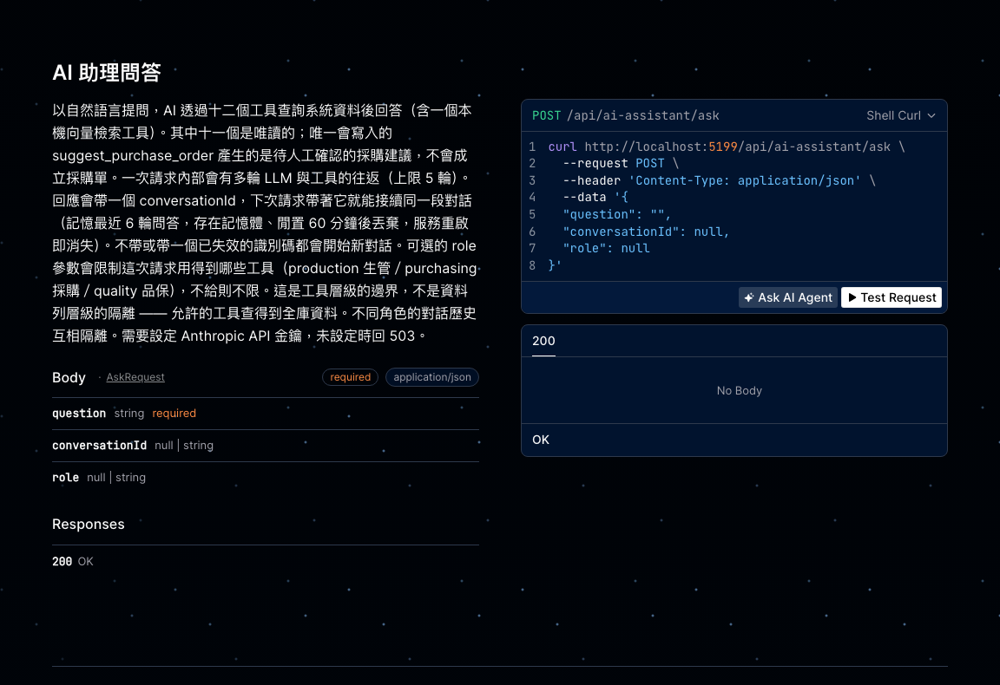
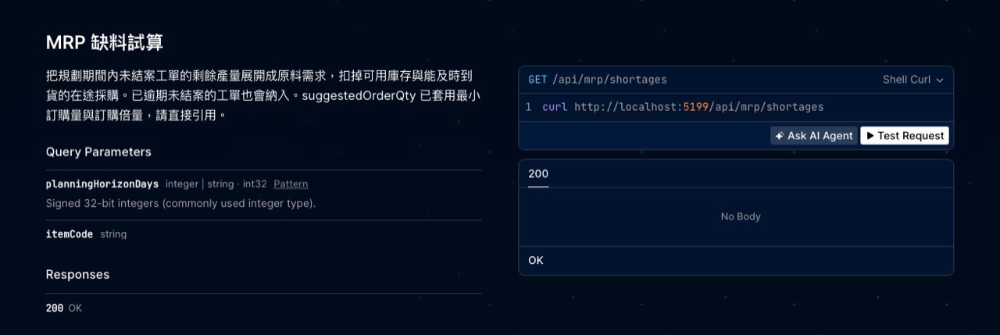

# 展示腳本與面試問答

> 本文件的所有 REST 輸出都是實際跑出來貼上的，不是手寫的示意。
> AI 助理端點的**工具呼叫序列與數字**由測試驗證，但**回覆的自然語言文字**
> 尚未對真實 Anthropic API 驗證過（開發機沒有金鑰），文中會標明。

---

## 1. 三十秒把它跑起來

```bash
export DOTNET_ROOT="/opt/homebrew/opt/dotnet/libexec"   # Homebrew 安裝 .NET 時需要
dotnet run --project src/Erp.Api --urls http://localhost:5199
```

不需要 Docker、不需要外部資料庫。開發模式會自動建表並灌入展示資料，
資料庫是一個 SQLite 檔（`src/Erp.Api/erp.db`），刪掉再啟動就重新產生。

**展示時從這裡開始**：http://localhost:5199/scalar/v1


互動式 API 文件（Scalar）。左側是十個端點的中文清單，主頁說明了這個系統在做什麼，
以及兩個最容易答錯的地方 —— 可用庫存與帳上庫存的差別、多階 BOM 用量的分母。

點進任一端點，會看到中文說明、參數型別、curl 範例，以及一個可以直接試打的 Test Request：



端點說明刻意不只寫「這個端點做什麼」，也寫清楚使用上的陷阱 ——
例如 AI 助理這條寫明「一次請求內部會有多輪 LLM 與工具的往返，但不保存跨請求的對話記憶」，
因為那正是最常被誤解的地方。

下面第 3 節的 curl 都可以改用這個介面操作，展示時對方不必看終端機。

啟動時會印出 AI 助理的生效設定：

```
AI 助理設定：模型 claude-opus-5，工具迴圈上限 5 輪，逾時 60 秒，API 金鑰來源：未設定（將交由 SDK 自行解析憑證，若無憑證會回 503）
```

要用 AI 助理才需要金鑰：

```bash
dotnet user-secrets set "AiAssistant:ApiKey" "sk-ant-..." --project src/Erp.Api
```

金鑰存在專案外（`~/.microsoft/usersecrets/`），不可能被誤 commit —— 這個 repo 是公開的。

### 開發時的三個指令

```bash
dotnet test                          # 166 個測試
dotnet format --verify-no-changes    # 格式是否符合 .editorconfig
dotnet build -warnaserror            # 警告視為錯誤，與 CI 一致
```

三者都由 GitHub Actions 在每次 push 與 PR 上執行（Release 組態）。
格式規範是 C# 4 空格、專案檔與 JSON/YAML 2 空格、統一 LF 換行；
Markdown 不砍行尾空白（那是換行語法），EF 產生的 migration 標記為 generated code 不套用規範。

**加上格式檢查的理由**：沒有 CI 驗證的話，`.editorconfig` 只是一份建議而不是規範。

---

## 2. 展示資料的結構

```
TV-100（液晶電視）
├── PANEL-01   × 2      面板：帳上 100 片，其中 20 片已被其他工單保留 → 可用 80 片
├── CHASSIS-02 × 3
│   └── SCREW-05 × 4    螺絲對成品的用量是 3 × 4 = 12 支
└── CABLE-07   × 1
```

兩張未結案工單：一張缺料、一張逾期。**所有日期與單號都以執行當天為基準相對產生**，
資料不會過期 —— 下面範例輸出裡的 `2026-09-10` 會換成你執行當天的日期。

---

## 3. 展示腳本

### 3.1 可用庫存 vs 帳上庫存（一個容易答錯的問題）

```bash
curl "http://localhost:5199/api/items/TV-100/sufficiency"
```

```json
{"itemCode":"TV-100","bomVersion":"v3","basis":"available","maxBuildableQty":40,
 "sufficientForRequestedQty":null,"shortageComponents":[]}
```

**看點**：面板帳上有 100 片，除以每台 2 片會得到 50 台。正確答案是 **40 台** ——
因為 20 片已被其他工單保留。`basis: "available"` 就是在宣告這件事。
用帳上庫存計算會系統性偏樂觀，實務上就是「系統說夠、現場缺料」。

### 3.2 指定產量時列出瓶頸

```bash
curl "http://localhost:5199/api/items/TV-100/sufficiency?plannedQty=100"
```

```json
{"itemCode":"TV-100","bomVersion":"v3","basis":"available","maxBuildableQty":40,
 "sufficientForRequestedQty":false,
 "shortageComponents":[{"componentCode":"PANEL-01","componentName":"面板",
   "requiredPerFinishedUnit":2,"availableQty":80,"shortfallQty":120}]}
```

**看點**：`requiredPerFinishedUnit` 的分母是「最終成品一台」而不是直接上階父件。
螺絲在這個結構下是 12 而不是 4（3 × 4），多階 BOM 的累乘由後端處理，不讓 LLM 自己換算。

### 3.3 風險工單：兩種風險來源

```bash
curl "http://localhost:5199/api/work-orders/at-risk"
```

```json
[{"workOrderNo":"WO-20260910-02","itemCode":"MON-200","dueDate":"2026-09-08",
  "delayDays":2,"riskReason":"已逾交期 2 天，尚有 10 個未完工"},
 {"workOrderNo":"WO-20260910-01","itemCode":"TV-100","dueDate":"2026-09-13",
  "delayDays":2,"riskReason":"缺料：PANEL-01 短少 120 件"}]
```

**看點**：兩張都延遲 2 天，但原因完全不同 —— 一張已經逾期，一張是補料前置期（5 天）
超過剩餘工作天（3 天）。缺料判定只針對「剩餘待產數量」，已完工的部分不會重複算料。

### 3.4 MRP：建議採購量不是缺料量



API 文件裡就寫明了兩個關鍵前提：已逾期未結案的工單也會納入、
`suggestedOrderQty` 已套用最小訂購量與訂購倍量所以要直接引用。
這兩件事都是用了才會發現的陷阱，寫在端點說明比藏在 README 有用。

```bash
curl "http://localhost:5199/api/mrp/shortages"
```

```json
{"basis":"available","horizonStart":"2026-09-10","horizonEnd":"2026-10-10",
 "shortageItems":[{"itemCode":"PANEL-01","itemName":"面板","grossRequirementQty":210,
   "availableQty":80,"inTransitQty":0,"netShortageQty":130,"neededByDate":"2026-09-08",
   "suggestedOrderQty":150,"supplierCode":"SUP-008","leadTimeDays":5}]}
```

**三個看點**：

- `grossRequirementQty` 是 210 而不是 200 —— **已逾期未結案的工單也要料**。
  這是實作時測試抓到的 bug：原本查詢起點用「今天」，把逾期工單整批漏掉了。
- `inTransitQty` 是 0，但其實有一張 30 片的採購單在途 —— 它 10 天後才到，
  趕不上 9/08 的需求日，所以不能算成供給。
- `suggestedOrderQty` 是 150 而不是 130 —— 套用了訂購倍量 50。
  這個數字要直接引用，system prompt 明文禁止 LLM 自己從缺料量推算。

### 3.5 品管：後端先彙總，不讓 LLM 加總

工單號是以執行當天產生的（`WO-<今天>-02`），所以先帶入日期：

```bash
curl "http://localhost:5199/api/quality/summary?workOrderNo=WO-$(date +%Y%m%d)-02"
```

```json
[{"workOrderNo":"WO-20260910-02","itemCode":"MON-200","inspectedQty":20,
  "passedQty":17,"failedQty":3,"failReasonSummary":"外觀刮傷、亮點超標"}]
```

**看點**：這張工單有兩筆檢驗紀錄，後端合併成一列才交給 LLM。
凡是「多筆資料要加總」的情況都在後端做完，減少 LLM 動手算的機會。

### 3.6 AI 助理

```bash
curl -X POST http://localhost:5199/api/ai-assistant/ask \
  -H 'Content-Type: application/json' \
  -d '{"question":"這週有哪些工單有延遲風險？缺料的話幫我列建議採購清單。"}'
```

一次 HTTP 請求內部會跑多輪 LLM ↔ 工具往返：

1. LLM 要求呼叫 `list_work_orders_at_risk()`
2. 後端回傳上面 3.3 的 JSON
3. LLM 要求呼叫 `run_mrp_shortage_analysis()`
4. 後端回傳上面 3.4 的 JSON
5. LLM 組出自然語言答案

**步驟 1–4 與其中的數字由 `AiAssistantScenarioTests` 驗證**（用假 LLM 跑真資料庫）。
步驟 5 的文字尚未對真實 API 驗證過。

沒有設定金鑰時回 503 與清楚訊息，不會洩漏 SDK 堆疊：

```json
{"title":"AI 助理暫時無法使用","status":503,"detail":"AI 助理尚未設定 API 金鑰，或金鑰無效"}
```

### 3.7 稽核軌跡

每次工具呼叫都留一筆結構化紀錄：

```
工具呼叫 get_item_inventory_status 完成，成功：True，耗時 12 ms，參數：{"item_code":"PANEL-01"}
```

助理最後只吐出一段自然語言，沒有這條 log 就無從得知那段話是根據哪些查詢組出來的。
這是「整個過程可追蹤、不是黑箱」的依據。

---

## 4. 面試問答

每一題的答案都指得出對應的程式碼或測試 —— 講不出證據的答案不要用。

### Q：為什麼 Domain 不能碰 AI？怎麼保證？

Domain 是 BOM、工單、庫存這些核心規則，它們的正確性跟用不用 LLM 無關。
LLM 整套換掉、甚至拿掉 AI 助理，Domain 都不該動一行。

保證的方式不是自律，是 `Erp.ArchitectureTests`：Domain 不得相依其他層、
不得參考 EF Core 或任何 LLM 廠商套件。違反會讓 CI 紅。

**這裡有個實作時的發現值得講**：一開始只用 NetArchTest，實測發現它擋不住 ——
它檢查的是 `Erp.*` 命名空間，對外部套件無感。在 Domain 裡寫
`typeof(Anthropic.AnthropicClient)` 時，只有我另外加的組件參考檢查會紅。
（順帶一提，用 `nameof` 測不出來，那是編譯期常數，不會在 IL 留下型別參考。）

### Q：怎麼防止 AI 編造數字？

四層，由強到弱：

1. **工具只能查，不能寫。** 八個工具沒有一個會寫入資料庫，這是設計上的硬限制。
2. **數字都由後端算好。** 工具回傳固定 schema 的 JSON，LLM 拿到的是計算結果不是原始資料。
   連「兩筆檢驗紀錄加總」這種小事都在後端做完。
3. **system prompt 明文禁止推算**，並規定工具失敗時如實回報。
4. **測試。** `AiAssistantScenarioTests` 驗證送進 LLM 的每個數字都是後端算出來的值。

第 1 到 3 層都可能被繞過或失效，所以第 4 層才是真正的保證。

### Q：tool-use 迴圈會不會失控？

有輪數上限（預設 5，可設定），達到上限回覆一段說明而不是拋例外 ——
使用者需要知道發生什麼事，而不是看到 500。有測試模擬「LLM 每輪都要求呼叫工具、
永不給答案」，驗證會在第 N 輪停下。

### Q：一個工具壞掉會怎樣？

會降級成那一個工具的失敗，其他工具的結果照常送達 LLM。

這件事一開始沒做到 —— 原本只攔三類已知例外，資料庫連線失效會穿過整個迴圈變成 HTTP 500，
即使同一輪其他工具的結果是好的也一起陣亡。後來補上總括攔截，例外全文只進伺服器 log，
回給 LLM 的內容不含型別或堆疊（那些它可能原樣轉述給使用者）。

錯誤帶結構化 `error_code`，system prompt 逐碼規定該怎麼反應 ——
`ENTITY_NOT_FOUND` 直接告知查不到，`INVALID_ARGUMENT` 可改參數重試一次，其餘不要重試。

### Q：要換成 OpenAI 需要改什麼？

只改 `AnthropicLlmClient` 一個類別。`ILlmClient` 與 `Llm*` 模型是供應商中性的，
tool-use 迴圈、`ToolCatalog`、`ToolDispatcher` 都不認識 Anthropic。

規劃文件原本寫這個類別要「純 HTTP 呼叫」，我改用官方 SDK ——
供應商隔離的目的由介面達成，跟底下用不用 SDK 無關，手刻 HTTP 去組
`tool_use`/`tool_result` 的 union 結構只是額外放棄型別安全。

### Q：為什麼用 SQLite 而不是 SQL Server？

作品集的價值在架構與 AI 模組，而「對方能在自己機器上一行指令跑起來」比技術棧書面一致更有說服力。
換 provider 的成本大約一次工作階段，隨時可以做。

**這裡我犯過一個錯，值得講。** 我原本在文件和註解裡寫「SQLite 把 decimal 存成 TEXT，
資料庫層無法正確比較或排序」，還打算為此加一條約束測試。實測後發現是錯的 ——
EF Core 的 SQLite provider 會註冊 `ef_compare()`、`ef_sum()` 與 `EF_DECIMAL` collation：

```sql
WHERE ef_compare("i"."OnHandQty", '50.0') > 0
ORDER BY "i"."OnHandQty" COLLATE EF_DECIMAL
```

如果沒實測就照著寫下去，會做出一條保護不存在問題的測試。現在改成
`SqliteDecimalBehaviourTests` 把真實行為釘住。真正的限制是這些函式只存在於
EF Core 開的連線，原生 SQL 查同一個檔案會退回字典序。

### Q：你的測試怎麼證明它們真的有效？

**把防線拔掉，看測試會不會紅。** 這個專案每一條關鍵防線都做過反向驗證：

| 拔掉什麼 | 結果 |
|---|---|
| 可用庫存改回帳上庫存 | 紅 1 條 |
| 多階 BOM 的累乘 | 紅 4 條 |
| MRP 的逾期工單納入 | 紅 2 條 |
| 採購單查詢的批次化（改回 N+1） | 紅 1 條（查詢次數 +6 vs +2） |
| 多個 tool_result 拆成多則訊息 | 紅 1 條 |
| 未預期例外的總括攔截 | 紅 4 條 |
| 錯誤的 `error_code` 欄位 | 紅 13 條 |
| 稽核 log | 紅 5 條 |
| 灌種子資料的併發容忍 | 紅 2 條（3 次執行都紅，錯誤訊息與原始 flaky 一致） |

沒有紅的測試等於沒有測試。**這個習慣抓到過一次我自己的錯誤**：
架構測試第一次反向驗證是綠的，我一度以為測試無效，深挖後發現是實驗寫錯了
（`nameof` 不產生型別參考），改用 `typeof` 就紅了。

### Q：開發過程中最有價值的 bug 是哪個？

**一個 flaky 測試，症狀是「每個 build 組態的第一次執行才失敗」。**
錯誤是 `UNIQUE constraint failed: bom_lines...`。重跑五次都通過，很容易就當成環境雜訊放過。

根因是灌種子資料不具備併發安全：`WebApplicationFactory` 會建立 host 不只一次，
冷啟動時兩次 seeding 真正重疊，雙方都通過了「是否已有資料」的檢查；
熱身之後第一次太快完成，第二次就只看到資料而跳過 —— 這就是為什麼只有第一次會炸。

**調查過程中我犯過一個錯**：第一次寫的併發測試顯示「併發 seeding 成功」，
差點就據此排除這個方向。但那個測試用 in-memory SQLite —— 共用單一連線，
寫入天然被序列化，根本測不出併發。改用檔案 SQLite 才重現得出來。
這件事的教訓是：**測試環境與真實環境的差異本身就會製造偽陰性**。

這也不只是測試問題 —— 多個 API 實例同時啟動時，生產環境是一模一樣的競態。

**MRP 漏算逾期工單。** 加端到端測試時，用種子資料算出來的毛需求跟我預期的數字對不上。
第一反應是測試寫錯，但追下去發現是實作的問題：查詢起點用「今天」，
把交期已過但還沒做完的工單整批擋掉了 —— 那些工單仍然要料，而且是最急的需求。

這個 bug 用假的 Repository 測不出來，因為 fake 跟真實 Repository 有同樣的過濾邏輯；
是「用真資料庫 + 真種子資料跑端到端」才浮出來的。

另一個是 **SDK 把中文逃逸成 `\uXXXX`**，實測讓請求體積變成 2.28 倍，
而工具說明每一輪都重送 —— 這是每次呼叫都在付的 token 成本。
SDK 沒有序列化設定點，用 `DelegatingHandler` 在送出前重新序列化解決。

---

## 5. 已知限制（會被問到，先準備好）

- **AI 助理是單輪問答**，沒有跨請求的對話記憶。追問「那它的供應商是誰」時不知道「它」指什麼。
  `AskAsync` 預留了加 `conversation_id` 的空間。
- **`AnthropicLlmClient` 尚未對真實 API 驗證過。** 送出的 HTTP 請求內容用本機假伺服器
  逐欄檢查過，但沒有金鑰就無法確認 Anthropic 會接受它。這是目前唯一「編譯過、
  測試過、沒真的跑過」的環節。
- **沒有使用者權限隔離**：AI 唯讀，但查得到全庫資料。擴充方式是在 `ToolDispatcher`
  注入呼叫者身分並下推到查詢服務。
- **MRP 沒有時間分桶**：同一料號的需求日取最早的那張工單，建議採購會偏保守。
- **BOM 展開是逐階查詢**，深層 BOM 會放大成本。正解是遞迴 CTE，目前資料量下不構成問題。

---

## 6. 授權

[MIT](../LICENSE)。著作權人是 repo 擁有者，程式碼可自由使用、修改與再散布，
但不附任何擔保。原始碼在 https://github.com/thothawei/manufacturing-erp
