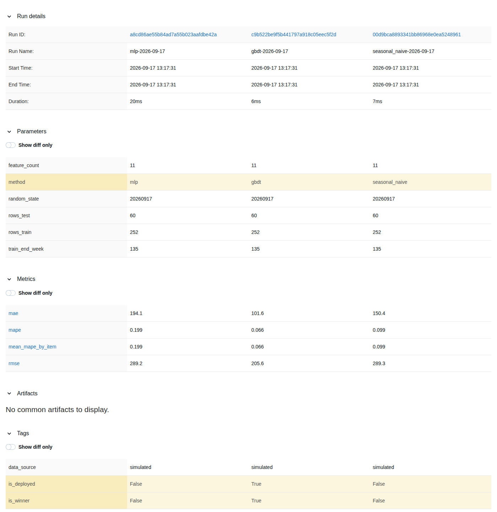

# 物料需求時間序列預測 v1（2026-09-17）

規劃在 [`ml-dl-llm-strengthening-plan-v1.md`](ml-dl-llm-strengthening-plan-v1.md) 的 S6（選做）。
格式比照 [`ml-risk-prediction-module-plan-v1.md`](ml-risk-prediction-module-plan-v1.md)：
決策、取捨、驗證方式，維持文件體系一貫的敘事風格。

## 1. 這個模組要證明什麼

前一個 ML 模組（工單延遲風險）證明的是「傳統 ML pipeline 接得起來、每個決策講得清楚」。
這個模組要多證明一件事：**DL 不一定贏，而且要用數字說清楚贏或不贏**。

三個對照方法：

1. **seasonal naive**（基準線，不能省）—— 預測 = 去年同一週的實際值。零訓練成本，
   任何比它複雜的方法都要先打贏它才有存在的理由。
2. **GBDT with lag features**（LightGBM）—— 表格資料，樹模型的標準做法。
3. **小型 DL**（MLPRegressor）—— 見第 7 節「為什麼不是 N-BEATS / 1D-CNN」。

**實測結果**（2026-09-17，見第 8 節細節）：GBDT 贏（整體 MAPE 6.63%），
seasonal naive 其次（9.88%），MLPRegressor 明顯最差（19.92%）。
跟原規劃預期的「小樣本時間序列上 seasonal naive 打敗 DL 是常態」不完全一樣——
DL（MLPRegressor）確實輸了，但輸給的是 GBDT，不是 seasonal naive。
這個差異本身就是誠實對照的價值：**先猜的結論不算數，跑出來的才算數**。

## 2. 範疇界定

- **不做**：把預測接回 MRP 的採購建議邏輯。`MrpCalculationService` 現有的固定需求算法
  有自己的測試與既有行為，用預測值取代會是一個影響既有功能的重大變更，
  不是這個選做模組該附帶做的事。
- **不做**：即時／線上重訓、模型監控。理由與延遲風險模型一致（見該文件第 11 節），
  這裡不重複一次。
- **做**：一條完整、誠實的時間序列 pipeline——資料生成 → 特徵工程 → 三方訓練與評估
  → 落地成一個可以獨立呼叫的預測端點。

## 3. 資料

現有種子資料是「今天」這個時間點的快照（庫存餘額、在製工單、在途採購單），
沒有任何歷史時間序列——這正是這個模組第一個要處理的問題：**系統裡沒有這種資料**，
所以第一步是生成模擬的週別需求歷史。

`MaterialDemandHistoryGenerator`（`src/Erp.Application/Ml/`）：

- 品項固定用種子資料裡已經有的三個原物料——PANEL-01、SCREW-05、CABLE-07。
  不是憑空編三個新料號，讓這個模組跟既有的 MRP／BOM 資料是同一組世界觀。
- 156 週（3 年）：seasonal naive 需要至少 52 週才有「去年同週」可以參照，
  3 年才能切出「前 2 年訓練、最後 1 年測試」且測試集本身滿一個完整季節週期。
- 每個品項各自的 `base_level`／`seasonal_amplitude`／`phase`／`trend` 都不同
  （PANEL-01 旺季在年中、SCREW-05 波動平緩、CABLE-07 波動最大且緩步衰退），
  讓「品項」這個維度真的有訊號，跟延遲風險生成器裡每個品項各自的逾期比例是同一個設計理由。
- 3% 需求缺值（模擬盤點週或系統停機沒記到）。刻意沒有加離群值——這個模組要驗的是
  「季節性與趨勢抓不抓得到」，資料清理那件事 `HistoricalWorkOrderGenerator` 已經做過，
  不需要重講一次。

```bash
dotnet run --project tools/Erp.MlDataGen -- demand-forecast
```

## 4. 資料清理與特徵工程

**特徵工程做在 Python 訓練腳本裡，不是 C#**——這是跟延遲風險模型刻意不同的地方，
理由要講清楚：那個模型「資料生成寫在 C#」的核心原因是避免 training/serving skew——
線上推論會在請求當下用 C# 重新算一次特徵，如果訓練資料的特徵是另一份 Python 邏輯
算出來的，兩邊就有兩個獨立的「齊套率該怎麼算」，會慢慢長出差異。

這個模組沒有這個風險，因為**沒有第二個地方在算同一件事**：這個系統目前沒有任何地方
持久化「歷史週別實際需求」，線上推論不會、也不能自己重新算 lag／移動平均特徵——
呼叫端必須直接把算好的特徵值放進請求（見第 9 節）。只有一份特徵工程實作，
放在 Python 這一側（比照 `ml/train.py` 的 `clean()` 已經在做的事——那裡的中位數補值、
winsorize 也是留在 Python），沒有「兩邊算出來不一樣」的可能。

`ml/train_demand_forecast.py` 的特徵工程：

- **缺值**：線性內插（`pandas.Series.interpolate(method="linear")`），不是中位數或刪除。
  時間序列補值要保留局部趨勢——中位數會把有季節性起伏的週硬拉回一個全域中心值，
  破壞掉正是這個模組要學的訊號。頭尾缺值沒有兩側可以內插，退回最近的已知值。
- **特徵**（11 個，欄位順序見第 7 節）：`lag_1`～`lag_4`（近四週）、`lag_52`（去年同週，
  seasonal naive 直接用這一欄）、`rolling_mean_4`、`rolling_mean_12`（移動平均）、
  `week_of_year`（捕捉季節性）、三個品項的 one-hot（`item_is_panel01`／`item_is_screw05`／
  `item_is_cable07`）。
- **捨棄的候選**：品項的「基期水位」（例如訓練集內該品項的平均需求）——
  one-hot 加上樹模型／NN 本身就能學到品項間的水位差異，多一個衍生特徵只是重複資訊。

## 5. 訓練/測試切分

時間序列不能隨機切分（會洩漏未來資訊給模型），一律用時間切點：
週次 ≤135 的樣本當訓練集（252 筆，跨三個品項），週次 >135 當測試集（60 筆，20 週）。
三個品項共用同一個全域切點，而不是各自切 80/20——所有品項共用同一段日曆時間，
這樣才符合真實情境（不會有品項的「測試期」落在另一個品項的「訓練期」之前）。

## 6. 模型

### GBDT：LightGBM，200 棵樹、max_depth=4、learning_rate=0.05

表格資料 + 少量特徵的標準選擇，訓練成本是秒級，可解釋性比 MLP 好（有特徵重要性）。

### 小型 DL：為什麼是 MLPRegressor，不是 N-BEATS / 1D-CNN

原規劃寫的是 N-BEATS 或 1D-CNN。這裡改用 scikit-learn 的 `MLPRegressor`，理由：

1. **這個 repo 的訓練工具鏈只有 scikit-learn**，沒有 PyTorch／TensorFlow。裝一個新的
   深度學習框架換到的是「架構上更貼近時間序列」，但在 3 個品項、156 週的資料量下，
   這個差異對最終結果的影響遠小於「資料量本身夠不夠」——換一個更重的框架
   不會改變這一節原本的論點（DL 不一定贏），只會多一個新相依。
2. **MLPRegressor 依然是一個用反向傳播訓練的神經網路**，跟 N-BEATS/CNN 的差別
   在於沒有時間序列結構化的 inductive bias（不會顯式建模趨勢/季節性分解，
   不會用卷積核抓局部時間模式）——這個差異本身也值得記錄：
   一個「通用」的小型 DL 架構在這個資料量級上明顯輸給 GBDT（MAPE 19.92% vs 6.63%），
   這正是「DL 不是裝飾品，但也不是萬靈丹」的具體例子。

這個取捨是誠實記在這裡的，不是後補的藉口——如果之後要做「真的」時間序列 DL
（N-BEATS、TFT 之類），需要先裝對應的框架，這件事在
[`ml-dl-llm-strengthening-plan-v1.md`](ml-dl-llm-strengthening-plan-v1.md) 有留伏筆。

### 決勝負的指標：逐品項 MAPE 的平均，不是整體 MAE

三個品項的需求量級差十幾倍（PANEL-01 均值 ~250，SCREW-05 均值 ~4000），
直接比整體 MAE 會被量級最大的品項主導，等於只評到 SCREW-05 一個品項的表現。
MAPE 是無單位的相對誤差，三個品項的分數才比得公平。

## 7. 特徵順序（唯一真相：`MaterialDemandForecastFeatures`）

```
lag_1, lag_2, lag_3, lag_4, lag_52,
rolling_mean_4, rolling_mean_12, week_of_year,
item_is_panel01, item_is_screw05, item_is_cable07
```

Python 端的 `FEATURES` 常數與 C# 端的 `MaterialDemandForecastFeatures.FeatureNames`
必須逐字一致。`OnnxMaterialDemandForecastModel` 載入時會比對這件事，
對不上就把 `IsAvailable` 判定為 false（跟延遲風險模型的同一道防線，見 README「第四道防線」）。

## 8. 評估結果（2026-09-17 實測，seed=20260917）

| 方法 | 整體 MAE | 整體 RMSE | 整體 MAPE |
|---|---|---|---|
| seasonal naive | 150.40 | 289.27 | 9.88% |
| **GBDT（部署）** | **101.63** | **205.62** | **6.63%** |
| MLPRegressor | 194.14 | 289.17 | 19.92% |

逐品項 MAPE（GBDT）：PANEL-01 約 8%、SCREW-05 個位數百分比（量大波動相對平緩）、
CABLE-07 最高（波動最大的品項，符合預期——振幅最大的序列本來就最難預測）。
完整逐品項數字在 `src/Erp.Infrastructure/Ml/material-demand-forecast-model.json`
的 `comparison.by_item`。

**GBDT 贏了 seasonal naive，也贏了 MLPRegressor**。這不是預先設計好的結果——
訓練腳本是先寫好三方都跑、依實測 MAPE 選贏家，不是「訓練完看到 GBDT 贏才回頭
把它包裝成主線」。`deployed_model` 固定是 `gbdt`，這次剛好與 `winner_by_mape` 一致，
metadata 裡的 `deployment_note` 會誠實記錄兩者是否一致（萬一之後重訓换了贏家，
這個欄位會如實反映「部署的不是贏家」而不是悄悄配合著改）。

### 實驗追蹤（MLflow）

`ml/train_demand_forecast.py` 把三個方法各記成同一個 experiment（`material-demand-forecast`）
底下的一個 run——這正是這個模組最初判斷「MLflow 要等有多個實驗可比才划算」的那個情境，
三方對照天生就是三個 run。本機 file store（`ml/mlruns/`，不進 repo），本機看比較表：

```bash
ml/.venv/bin/mlflow ui --backend-store-uri ml/mlruns
```



`is_winner`／`is_deployed` 兩個 tag 讓「贏家是誰」與「部署的是誰」在 UI 上一眼看到，
不用另外回頭查 JSON——這次兩者剛好都是 GBDT。

## 9. 落地整合

新增 `IMaterialDemandForecastModel` port（`Erp.Application.Ml`）與
`OnnxMaterialDemandForecastModel` 實作（`Erp.Infrastructure.Ml`），
結構比照 `IDelayRiskModel`／`OnnxDelayRiskModel`：可選模組、模型檔載不起來時
`IsAvailable` 為 false 且不擲例外、執行期比對特徵順序（第 7 節）。

**新增的端點是 `POST /api/ml/demand-forecast`，不是 `GET`**，而且特徵由請求體提供，
不是伺服器查出來的。這是因為系統裡沒有歷史週別需求這個實體——延遲風險模型的
`WorkOrderDelayFeatures` 有唯一的計算方式（BOM/庫存/工單即時算），這個模型沒有，
所以介面誠實地反映這件事：呼叫端要自己準備好 `lag_1`～`lag_52`／`rolling_mean_4`／
`rolling_mean_12`／`week_of_year`。

**沒有掛成 AI 工具（第十三個工具）**：現有十二個工具的數字在 README／one-pager／
系統提示詞等處被引用非常多次，加一個工具會牽動一長串文件同步，而且這個工具
需要呼叫端自己組出一組 lag 特徵——不像其他十二個工具「給料號/工單號，後端查現有
資料就回答得完整」，LLM 沒有管道自己生出這些歷史數字，硬掛上去只會是一個
使用者永遠不會自然問出、模型也答不出來的工具。等這個系統真的有歷史需求資料
可以查的時候，再讓它加入工具清單會更有意義。

## 10. 仍然沒有的東西

- **沒有真的歷史需求資料，也沒有地方存**：這是最根本的缺口。要讓這個端點
  真的有用，得先有一張記錄「這個品項這一週實際出了多少料」的表，
  那是比這個模組本身更大的工程（要接盤點、發料紀錄），這裡刻意不做。
- **沒有分布外（OOD）檢查**：延遲風險模型的 `weekly_load_ratio` OOD 檢查抓的是
  「這張工單的特徵組合模型沒見過」，這裡同樣可以做（比對 lag 值是否落在訓練分布外），
  但這個選做模組的預算优先花在把三方對照做誠實，OOD 檢查留給下一輪。
- **沒有接回 MRP**：見第 2 節範疇界定。
- **MLPRegressor 只調了一組超參數**（隱藏層 32/16、early stopping），沒有做網格搜尋。
  這個模組的重點是「誠實對照」不是「把每個方法都調到最優」——調更細不會改變
  「這個資料量下通用 MLP 架構打不過 GBDT」這個結論的方向，只會讓兩者的差距變小或變大。

## 11. 怎麼重跑

```bash
# 一、產生訓練資料（特徵定義的唯一真相在這個生成器）
dotnet run --project tools/Erp.MlDataGen -- demand-forecast

# 二、訓練、評估、匯出 ONNX
python3 -m venv ml/.venv && ml/.venv/bin/pip install -r ml/requirements.txt
ml/.venv/bin/python ml/train_demand_forecast.py

# 三、驗證 ONNX 載進 .NET 後算出同一個數字
dotnet test tests/Erp.Infrastructure.Tests --filter "FullyQualifiedName~MaterialDemandForecastModelTests"
```

**推論不需要 Python。** 模型以 ONNX 進 repo，由 `Microsoft.ML.OnnxRuntime` 載入——
clone 下來跑 `dotnet test` 不必裝任何 Python 套件，跟延遲風險模型同一個設計。
